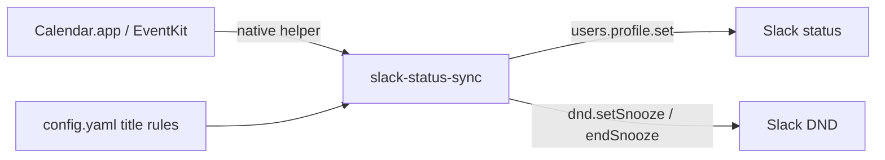

# slack-status-sync

Local macOS automation that sets your Slack status and notification snooze from **Calendar.app event titles**.

It polls your local calendars every 30 seconds (via EventKit). When a title-matched event **starts**, it applies the configured Slack status/emoji/expiry and DND behavior once. Manual Slack changes during an event are left alone; the next matched event start can override them.

No Microsoft Entra / Graph registration is required. Your work Outlook/Exchange events just need to appear in Apple’s Calendar app.

## How it works



- **EventKit** helper (`dist/calendar-reader`) reads calendars you already sync on this Mac
- **Slack user token** with `users.profile:write` and `dnd:write`
- Slack token stored in macOS Keychain (file fallback under `~/.slack-status-sync/secrets/`)
- Durable state in `~/.slack-status-sync/state.json` so restarts do not re-apply the same event

## Prerequisites

- macOS with Node.js 20+
- Xcode Command Line Tools (`swiftc`) to build the EventKit helper
- Work events visible in **Calendar.app** (System Settings → Internet Accounts)
- Ability to create a Slack app in your workspace

## 1. Create the Slack app

1. Go to [api.slack.com/apps](https://api.slack.com/apps) → **Create New App** → From scratch.
2. Under **OAuth & Permissions** → **User Token Scopes**, add:
   - `users.profile:write`
   - `dnd:write`
3. Install the app to your workspace.
4. Copy the **User OAuth Token** (`xoxp-...`).

No bot token, Event Subscriptions, or Socket Mode are required.

## 2. Confirm Calendar.app can see your work events

1. Open **Calendar.app**.
2. Ensure your Exchange / Microsoft 365 calendar is listed and events appear.
3. If missing: **System Settings → Internet Accounts → Add Account → Microsoft Exchange** (or your company account).

The sync tool reads Calendar.app, not the Outlook for Mac UI database.

## 3. Install and configure

```bash
cd slack-status-sync
npm install
npm run build
npm run dev -- init
```

Edit `~/.slack-status-sync/config.yaml`:

```yaml
# Optional allowlist of Calendar.app calendar titles
# calendarNames:
#   - "Calendar"

rules:
  - eventNameContains: "Focus"   # case-insensitive substring of event title
    status: "Focusing"
    emoji: ":dart:"
    notifications: snooze        # snooze | normal
    priority: 10                 # lower wins on overlap
```

## 4. Authorize Calendar + Slack

```bash
npm run build
npm run calendar:authorize   # opens Slack Status Sync Calendar.app
npm run calendar:list        # confirm calendars + upcoming titles
npm run auth:slack           # paste your xoxp- user token
```

`calendar authorize` opens a small helper app window and requests **Full Access**. After you allow it, look for **Slack Status Sync Calendar** under:

**System Settings → Privacy & Security → Calendars**

Bare CLI binaries usually never appear in that list on macOS 15; the `.app` bundle is required.

If the app does not appear after clicking Allow / Request Access:

```bash
npm run calendar:authorize -- --open-settings
open "$HOME/Applications/Slack Status Sync Calendar.app"
```

Then toggle Full Access for **Slack Status Sync Calendar** and re-check with `npm run calendar:list`.

**Why `calendar:list` can still say `notDetermined` after approving**

Two separate issues:

1. Node/Cursor child processes do not inherit the `.app` Calendar grant. This tool launches EventKit work with `open -a` against `~/Applications/Slack Status Sync Calendar.app`.
2. The app is **ad-hoc signed**. Each `npm run build` changes the binary hash, so an existing Settings toggle can look “on” while EventKit still reports `notDetermined` for the new binary.

Reset and re-approve against the current app **without rebuilding in between**:

```bash
npm run build
tccutil reset Calendar com.slack-status-sync.calendar-reader
open "$HOME/Applications/Slack Status Sync Calendar.app"
# Allow Full Access. The window must show "Visible calendars: N" with N > 0.
npm run calendar:status   # should show authorized: true
npm run calendar:list
```

## 5. Test once

```bash
npm run sync -- --dry-run   # select only; no Slack writes
npm run sync                # apply if an eligible event is active/starting
```

## 6. Run continuously

Foreground:

```bash
npm run run
```

At login via launchd:

```bash
chmod +x scripts/install-launchd.sh scripts/uninstall-launchd.sh
./scripts/install-launchd.sh
```

**Important:** run `calendar authorize` and verify `calendar list` interactively **before** installing launchd. Background agents cannot show the first TCC prompt reliably.

Logs go to `~/.slack-status-sync/sync.log` via launchd stdout/stderr redirection. Use `--log-file` only for interactive runs when you also want a file copy; combining it with launchd redirection duplicates lines.

Unload:

```bash
./scripts/uninstall-launchd.sh
```

## Sync rules

| Situation | Behavior |
|---|---|
| Title-matched event becomes active (start crossed since last poll) | Apply status + notifications once |
| Startup / first poll with an active unmatched-handled event | Apply highest-priority active matched event |
| Same event still active; you changed Slack manually | No further updates for that event |
| Event ends | No cleanup API call; Slack status expiry / snooze duration clear it |
| Later matched event starts | Apply and override previous automation/manual state |
| Overlapping starts in the same poll | Lowest `priority` wins, then earliest start, then rule text |
| Cancelled or declined events | Ignored |

Status expiry and DND snooze are set to the event end time.

Title matching is a **trimmed, case-insensitive substring** of the event title.

## CLI

```text
slack-status-sync init
slack-status-sync calendar authorize
slack-status-sync calendar status
slack-status-sync calendar list [--hours 24]
slack-status-sync auth slack
slack-status-sync sync [--dry-run]
slack-status-sync run
slack-status-sync logout [slack|all]
```

Useful flags:

- `--config <path>`
- `--verbose`
- `--log-file <path>`

Environment:

- `SLACK_STATUS_SYNC_CONFIG` — config path override
- `SLACK_USER_TOKEN` — non-interactive Slack auth

## Troubleshooting

| Symptom | Fix |
|---|---|
| `Calendar helper not found` | Run `npm run build` |
| `permission_denied` / empty calendars | Run `calendar authorize`; check System Settings → Privacy & Security → Calendars |
| No work events in `calendar list` | Add the Exchange account to Calendar.app (not only Outlook) |
| `Slack token not found` | Run `auth slack` |
| Status never changes | Confirm title substring matches; event must not be declined/cancelled; check logs |
| launchd cannot read calendars | Re-run authorize in Terminal; grant Calendar access to `dist/calendar-reader` and/or Node |
| Want a clean slate | `node dist/cli.js logout all` and delete `~/.slack-status-sync/state.json` |

## Development

```bash
npm test
npm run typecheck
npm run build
./dist/calendar-reader help
```

## Privacy

Structured logs include event IDs, matched rule text, calendar names, and outcomes. Full event **titles** and tokens are omitted/redacted from logs. `calendar list` prints titles on purpose so you can craft match rules.

## License

MIT
