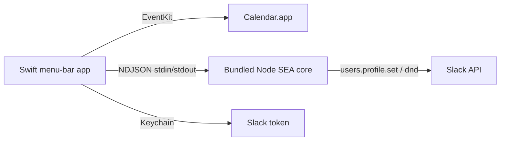

# Slack Status Sync

macOS **menu-bar** app that sets your Slack status and notification snooze from **Calendar.app** event titles.

It lives in the status bar as `🔄`, polls local calendars on a timer, and when a title-matched event **starts**, applies the configured Slack status/emoji/expiry and DND behavior once.

## Requirements

- macOS 14 Sonoma or newer (Apple Silicon or Intel — builds for your current CPU)
- Xcode Command Line Tools (`swiftc`, `xcrun`)
- Node.js 20+ (build machine only; the installed app embeds its sync core)
- A Slack user token with `users.profile:write` and `dnd:write`
- Work events visible in **Calendar.app**

## One-time: local code signing

Calendar permission survives rebuilds only when you sign with a **stable** certificate (not ad-hoc).

```bash
npm install
npm run setup:signing
```

Then open **Keychain Access**, find **Slack Status Sync Local**, Get Info → Trust → set **Code Signing** to **Always Trust**. Authenticate when prompted, then confirm:

```bash
npm run setup:signing
```

Keep that certificate. Rotating or deleting it will require re-approving Calendar access.

## Build and install

```bash
npm run build          # dist/Slack Status Sync.app (signed)
npm run install:app    # copies to /Applications (may ask for admin password)
```

`install:app` also:

- Removes the legacy CLI launchd agent and `~/Applications/Slack Status Sync Calendar.app`
- Deletes `~/.slack-status-sync` and the old Keychain token (fresh start)
- Opens the app

Install into **`/Applications`** so Launch at Login (`SMAppService`) and Calendar TCC stay on a stable path.

## First run

1. The Settings window opens automatically.
2. Click **Request Access** and grant **Full Access** to calendars.
3. Paste your Slack user token (`xoxp-…`). It is stored in Keychain and shown only as a fixed mask later.
4. Allow error notifications so persistent sync failures are visible.
5. Check the calendars that may update Slack. All visible calendars are selected on a fresh setup; selecting none disables calendar syncing.
6. Adjust rules (drag to set priority — top wins) and poll interval.
7. Click **Save** — settings apply immediately and a sync runs (unless paused).
8. Launch at Login is enabled by default when the app runs from `/Applications`.

## Status menu

| Item | Meaning |
|------|---------|
| Last Slack update | Last time status/DND was successfully changed |
| Last poll | Last completed calendar poll |
| Error / Status | Current health |
| Sync Now | Immediate idempotent poll |
| Pause / Resume | Session-only; resumes automatically on next launch |
| Settings… | Structured settings form |
| Quit | Stop the app |

## Settings storage

| Data | Location |
|------|----------|
| Settings | `~/Library/Application Support/Slack Status Sync/settings.json` |
| Sync state | `~/Library/Application Support/Slack Status Sync/state.json` |
| Logs | `~/Library/Application Support/Slack Status Sync/sync.log` |
| Slack token | Keychain service `com.slack-status-sync.app` |

There is no YAML config or terminal CLI anymore.

## Slack app setup

1. [api.slack.com/apps](https://api.slack.com/apps) → Create New App → From scratch.
2. **OAuth & Permissions** → User Token Scopes: `users.profile:write`, `dnd:write`.
3. Install to your workspace and copy the **User OAuth Token**.

## Rebuilds and Calendar permission

Rebuild and reinstall with the **same** signing certificate and bundle ID (`com.slack-status-sync.app`):

```bash
npm run build && npm run install:app
npm run verify:identity
npm run verify:rebuild   # builds twice and compares designated requirements
```

`verify:identity` fails if the designated requirement becomes cdhash-anchored (ad-hoc) or drifts from the stored baseline.

If Calendar access is lost (certificate rotated, TCC reset, or wrong path):

```bash
tccutil reset Calendar com.slack-status-sync.app
open -a "/Applications/Slack Status Sync.app"
```

Then use **Request Access** in Settings again.

## Development

```bash
npm run test:all
npm run typecheck
npm run smoke
npm run dev:sidecar   # NDJSON protocol on stdin/stdout (for debugging)
```

The native checks use a compiled Swift harness because standalone Xcode Command
Line Tools installations do not include XCTest. Calendar permission persistence
must still be accepted manually on a real Mac after rebuilding and reinstalling.

## Manual acceptance checklist

After installing a new build:

- Request Calendar access and confirm the status changes to **Full Access** and calendar checkboxes appear.
- Enter an invalid Slack token and confirm Save rejects it without replacing an existing token; then save a valid token.
- Edit every rule field, drag rules into a new order, toggle calendars (including Select None), save, and reopen Settings.
- Confirm Save resets the poll timer and performs an immediate sync, while Save during Pause does not sync.
- Quit and relaunch; confirm the last poll/update telemetry is restored and Pause has reset.
- Confirm Sync Now, Pause/Resume, Settings, Quit, error notifications, sleep/wake recovery, and Launch at Login.
- Run `npm run verify:rebuild`, reinstall, and confirm Calendar remains authorized without another prompt.

Architecture:



## License

MIT
